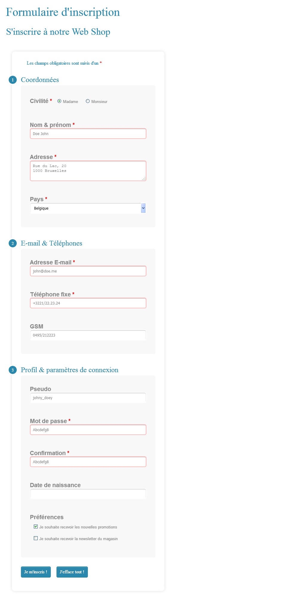

# "Formulaire d'inscription Web Shop"

> HTML exercise given at HEPL

* * *

**"Formulaire d'inscription Web Shop"** is an educational project, which will be used for `HTML` remedial courses.

**Note:** the school where the course is given, the [HEPL](http://www.provincedeliege.be/hauteecole) from Liège, Belgium, is a french-speaking school. From this point, the instruction will be in french. Sorry.

* * *

> Lors de vos cours de *web*, vous allez découvrir les langages HTML et CSS et les mettre en pratique pour apprendre à créer des pages web.  

* * *

## Formulaire d'inscription Web Shop

Vous trouverez dans ce dossier un fichier texte HTML nommé **index.html**. Cette page contiendra un formulaire prévu pour s'inscrire à un magasin virtuel (un "web shop").

Votre but est d'ajouter à cette structure&nbsp;:

- le formulaire,
- les ensembles de champs
- et (surtout) les champs de formulaires qui sont donnés sous formes de balises de commentaires. Par exemple &nbsp;:

```html
			<!-- début du formulaire "SingUp" method="post" action="#" -->
```

qui doit devenir la balise d'ouverture attendue, ou encore&nbsp;:

```html
			<!-- fin du formulaire "SingUp" -->
```

qui doit devenir la balise de fermeture attendue, ou encore&nbsp;:

```html
<!-- un champ de texte uniligne "nomPr" requis et dont le titre affiche au survol le texte repris juste après la balise i ci-dessous et avec un placeholder "Doe John" -->
```

qui doit devenir la balise attendue.

NB&nbsp;:
- dans ces exemples, `SingUp` et `nomPr` sont les noms des éléménts&nbsp;;
- les balises de commentaires (fournies) ``html <!-- info affichée au survol du label --> `` sont des *vrais* commentaires et ne doivent pas être remplaçées (elles doivent être laissées telles quelles).
 
Voci le rendu à obtenir ainsi que la liste précise des balises et attributs à utiliser (obligatoirement).

* * *

## Voici le rendu final&nbsp;:

### Rendu de index.html



* * *

## Voici la liste des balises et attributs à utiliser (obligatoirement)&nbsp;:

#### Les balises à utiliser (obligatoirement)&nbsp;:

- `form`
- `fieldset`
- `legend`
- `label`
- `textarea`
- `select`
- `option`
- `button`
- `input`

#### Les attributs à utiliser (obligatoirement)&nbsp;:

- `name`
- `id`
- `method`
- `action`
- `class`
- `for`
- `type`
- `value`
- `checked`
- `title`
- `placeholder`
- `required`
- `size`
- `selected`

Pour bien utiliser ces balises et ces différents attributs, assurez-vous de bien comprendre leur sémantiques et leur utilisations.

* * *

Bon travail !